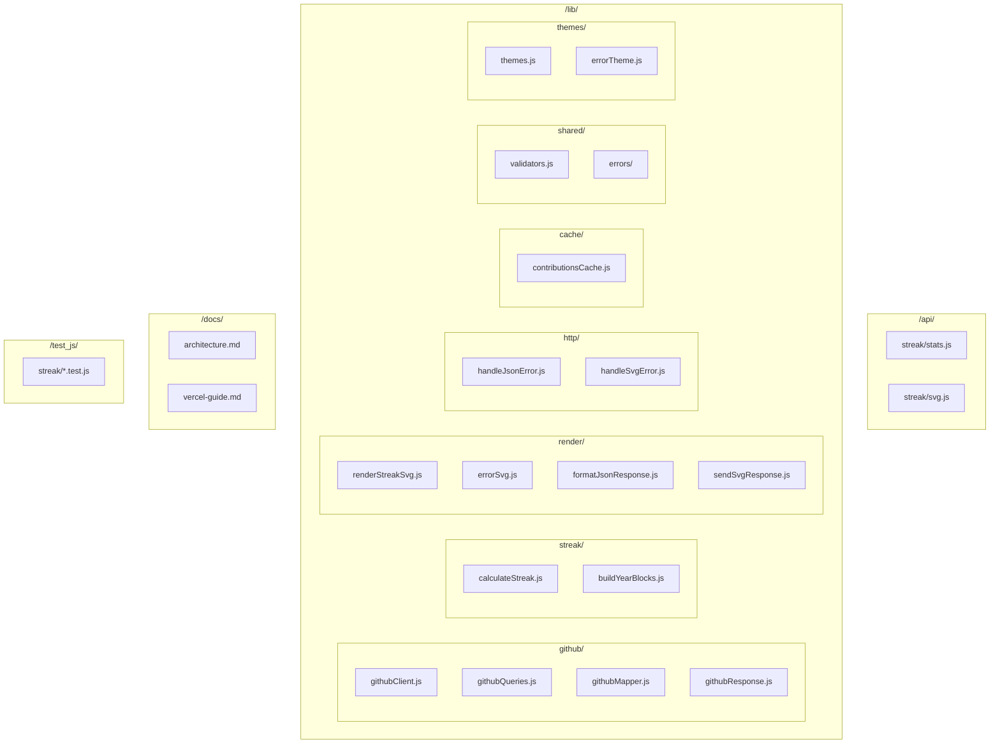
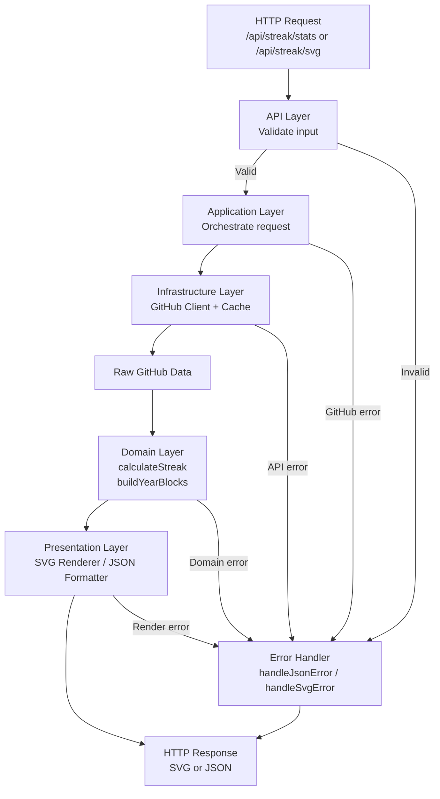

# Purpose of this document

This document describes the architecture of the:  
**Custom fork of [GitHub Readme Streak Stats](https://github.com/denvercoder1/github-readme-streak-stats) optimized for Vercel deployment.**

Its goals are:

- Provide a clear overview of how the project is structured.

- Explain the responsibilities of each folder and module.

- Serve as a reference for contributors and for future maintenance.

- Prevent business logic from being mixed within Vercel endpoints.

- Document the technical decisions made to adapt the original project to Vercel Serverless Functions.

This document is intended for:

- Myself (the fork's author)
- Anyone who wants to understand, extend, or deploy this project


# Project structure





# Principles of architecture

The architecture of this project is designed to support scalability, maintainability, and clarity within the constraints of Vercel Serverless Functions.
Every decision is intentional and aims to prevent common pitfalls found in serverless environments, such as duplicated logic, tight coupling, and untestable code.

The following principles guide the entire structure:


### Separation of Concerns

Each layer of the project has a single, well‑defined responsibility:

- API Layer `/api`
Handles HTTP input/output only.
No business logic, no GitHub calls, no rendering.

- Domain Layer `/lib/streak`
Contains pure streak‑calculation logic.
Free of side effects and external dependencies.

- Infrastructure Layer `/lib/github`, `/lib/cache`
Handles communication with GitHub and caching.
These modules can change without affecting the domain.

- Presentation Layer `/lib/render`
Responsible for producing SVG and JSON outputs.
No business logic, no GitHub logic.

- Cross‑cutting Utilities `/lib/shared`, `/lib/http`, `/lib/themes`
Validation, error handling, and theming.
This separation ensures that each part of the system can evolve independently.

### Endpoints as Orchestrators, Not Logic Containers

Vercel treats each file in /api as an isolated serverless function.
To avoid duplication and complexity:

- Endpoints only orchestrate the flow.
- All logic lives in /lib.
- Endpoints never contain business rules, rendering logic, or GitHub calls.

This keeps serverless functions small, predictable, and easy to maintain.

### Environment‑Independent Logic

All core logic is written to be platform‑agnostic:

- No Vercel‑specific code inside `/lib`.
- No direct access to req or res outside `/api`.
- No reliance on serverless runtime behavior.
This allows:
- local testing without mocks of Vercel internals,
- portability to other platforms,
- and long‑term maintainability.


### Modularity and Extensinility

The project is structured so that new features can be added without modifying existing modules.

Examples:

- Adding a new output format (e.g., PNG) only touches `/lib/render`.
- Adding a new GitHub query only touches `/lib/github`.
- Adding a new theme only touches `/lib/themes`.

This modularity reduces the risk of regressions and encourages contributions.

### Explicit Error Handling

Errors are treated as first‑class citizens:

- Custom error types (ValidationError, NotFoundError, etc.)
- Dedicated handlers for JSON and SVG responses
- A separate errorTheme to ensure consistent rendering

This prevents Vercel from returning its own error pages and ensures that all failures produce predictable, user‑friendly output.

### Clean Architecture Adapted to Serverless

The project follows Clean Architecture principles, adapted to the constraints of Vercel:

- Domain → pure logic
- Infrastructure → GitHub + cache
- Presentation → SVG/JSON
- Interface → API endpoints

This ensures:
- high testability
- low coupling
- clear boundaries
- long‑term maintainability

### Testability as a Design Requirement

The architecture is intentionally structured so that:

- The domain layer can be tested in isolation.
- Rendering can be snapshot‑tested.
- GitHub integration can be mocked.
- No test depends on Vercel runtime behavior.

This makes the project reliable and contributor‑friendly.


# Execution flow

At a high level, the system processes a request in the following stages:

#### HTTP request → API endpoint

- The user embeds the SVG or JSON URL in their GitHub profile or README.
- GitHub triggers an HTTP request to Vercel, hitting either:
- `api/streak/stats.js` (JSON output), or
- `api/streak/svg.js` (SVG output).

#### Input validation

- The endpoint extracts query parameters (e.g. user, theme, mode).
- Input is validated using the utilities in `lib/shared/validators`.
- If validation fails, a ValidationError is thrown and handled by the corresponding error handler (handleJsonError or handleSvgError).

#### Data retrieval from GitHub

- The endpoint delegates to githubClient in `lib/github` to fetch contribution data.
- Queries and mappings are handled by:
- githubQueries (GraphQL/REST queries),
- githubMapper (mapping raw responses to internal models),
- githubResponse (normalizing and handling GitHub-specific errors).
- Responses may be cached via contributionsCache to reduce API calls.

#### Domain logic: streak calculation

- Once contributions are available, the endpoint calls the domain layer:
- calculateStreak computes current, longest, and total streaks.
- buildYearBlocks prepares the yearly contribution structure when needed.
- This layer is pure logic: no HTTP, no GitHub, no Vercel.

#### Presentation: rendering the output

- Based on the endpoint:
- renderStreakSvg generates the SVG representation using the selected theme.
- formatJsonResponse builds the JSON payload.
- Themes are resolved via themes.js, while errors use a dedicated errorTheme.

#### Error handling

- Any error thrown along the way is caught in the endpoint try/catch.
- The endpoint delegates to:
- handleSvgError for SVG responses, or
- handleJsonError for JSON responses.
- These handlers:
- map internal errors to HTTP status codes,
- render either errorSvg or a JSON error object,
- ensure Vercel never returns its own HTML error page.

#### HTTP response

- Finally, sendSvgResponse or the JSON response helper sets headers (including cache control) and sends the response back to the client.
- GitHub then displays the SVG or JSON-backed badge in the user’s profile or README.


# Diagram



# Testing

The project originated from a fork, so it wasn't built from scratch. A functional foundation already exists, and strictly applying TDD doesn't make sense. The strategy is incremental: each time a significant part of the system is added or modified, tests are incorporated to ensure its correct operation.
The goal isn't complete coverage, but rather ensuring that the project's critical components are reliable, easy to understand, and compatible with future extensions.

## Principles/rules that apply

- Relevant new code is tested.

- The domain layer is prioritized because it contains the core logic.

- Tests should help make the project understandable to any contributor.

- Compatibility and maintainability are prioritized over dogmatism.

## What is tested 

## Test type

### Unit tests

Focus on isolated logic

- `calculateStreak`  (project core)
- `validators` (user entry)
- `renderStreakSvg` (visual output)
- `formatJsonResponse` (alternative output)
- `buildYearBlocksFromDate` (build years blocks)
- `githubResponse`(handle errors)

### Integration tests

Focus on module interaction

- `handleSvgError`(handle svg errors)
- `svgEndpoint`(full request → SVG response)

### Mocking strategy

External dependencies (such as GitHub API calls) are mocked in integration tests to ensure:

- deterministic results
- no dependency on external services
- faster test execution

This allows testing the full request → response flow without relying on real network calls.


### No testing

- Runtime of Vercel
- Objects req / res
- Wiring HTTP
- Deploy or infrastructure

These parts depend on the serverless environment and do not add value to the unit test.

## Testing tools

Vitest is used because:

The project uses Vitest, chosen for:

- Native ESM support
- Fast execution
- Snapshot testing
- Built‑in mocking
- Minimal configuration


## SETUP Vitest

```bash

npm install -D vitest

```

Add to package.json

```json

{
   "scripts": {
    "test": "vitest",
    "test:run": "vitest run"
    }
}

```

## Test Organization

All tests live under:

```bash

/test_js/

```

## Following the same folder structure as /lib:

```bash

test_js/
  streak/
    calculateStreak.test.js
    buildYearBlocks.test.js
  render/
    renderStreakSvg.test.js
    errorSvg.test.js
  shared/
    validators.test.js
  github/
    githubResponse.test.js

```

This mirrors the architecture and makes it easy to locate tests for any module.

# Roadmap

This project is designed to be self‑hosted by each user through a one‑click Vercel deployment.
Because every user runs their own instance, the roadmap focuses on customization, extensibility, and advanced analytics, rather than global scalability.
The project already includes a robust multi‑layer caching system:
- Vercel cache (automatic HTTP caching)
- 1‑hour internal cache for recent contributions
- 12‑hour internal cache for historical data
Future improvements focus on optimizing these layers, not adding new ones.

### Phase 1 — Customizable Error Rendering

Allow users to choose how error states are rendered, just like the main SVG.
Features
- &errorStyle=default|theme|compact|minimal
- &errorIcon=triangle|circle|none
- Option to reuse the user’s theme for errors
- Localizable error messages

### Phase 2 — Internationalization (i18n)

Enable multi‑language support for SVG and JSON outputs.
Features
- &lang=en|es|fr|de|pt|...
- Translation files under /lib/i18n
- Auto‑fallback to English
- Translated:
- labels
- error messages
- optional JSON keys

### Phase 3 — Extended GitHub Statistics

Since each user deploys their own instance, we can safely expand the scope of metrics without worrying about global rate limits.
New metrics

- Pull Requests (open, closed, merged)
- Issues (open, closed)
- Stars received
- Repositories created
- Total commits
- Most used languages
- Most active repositories
- Activity heatmaps

New renderers
- renderPrStatsSvg
- renderLanguageStatsSvg
- renderActivityHeatmapSvg

Unified API

```bash

/api/stats?type=streak|prs|languages|activity

```

### Phase 4 — Local Analytics & Insights

Because each user hosts their own instance, optional analytics can be added without privacy concerns.

Features

- Page visit counter (per‑user, per‑deploy)
- Contribution insights:
- most active days
- most active hours
- monthly trends
- Optional tracking:

```bash

&track=true

```

### Phase 5 — Theming System 2.0

Deep customization for power users.

Features

- Custom themes via URL:

```bash

&bg=000000&text=ffffff&accent=ff0000

```

- More built‑in themes:
- Catppuccin (Mocha, Latte, Frappe, Macchiato)
- Nord
- Dracula
- One Dark Pro
- Visual theme editor (future)

### Phase 6 — Performance & Caching Enhancements

The project already includes three layers of caching (Vercel, 1‑hour, 12‑hour).
Future work focuses on optimizing these layers, not adding new ones.

Planned improvements

- Smarter invalidation rules
- Separate cache buckets for:
- yearly contributions
- current streak
- rendered SVGs (optional)
- Retry logic for GitHub API
- Better handling of rate limits (per user)

### Phase 7 — Developer Experience & Extensibility

Make the project easy to extend and contribute to.

Features

- Plugin system:
- beforeFetch
- afterFetch
- beforeRender
- afterRender
- CLI tool:

```bash

npx streak-stats dev

```

- Full documentation website (Docusaurus or Astro)
- Interactive playground for themes and stats

# Technical decisions

This project is a self‑hosted, serverless‑friendly fork of GitHub Readme Streak Stats.
Every technical decision was made to ensure:
- simplicity
- maintainability
- performance
- portability
- and a great developer experience
Below are the key decisions and the reasoning behind them.

##  Why Vercel Serverless Functions?

Vercel provides:
- Zero‑config deployments
- Automatic scaling
- Global CDN caching
- Fast cold starts
- Perfect fit for small, stateless APIs
Since each user deploys their own instance, Vercel becomes the ideal environment:
- no shared load
- no global rate limits
- no infrastructure to maintain
- no need for a backend server
This aligns perfectly with the “Deploy Your Own” philosophy.

## Why a Clean Architecture?

The project is structured around Clean Architecture principles to ensure:
- domain logic is pure
- infrastructure can change without breaking the core
- presentation (SVG/JSON) is isolated
- endpoints remain thin orchestrators
This makes the project:
- easy to test
- easy to extend
- easy to maintain
- easy for contributors to understand

## Why SVG instead of PNG or images?

SVG was chosen because it is:
- resolution‑independent
- lightweight (1–3 KB)
- theme‑friendly
- easy to render dynamically
- supported natively by GitHub READMEs
PNG would require:
- rasterization
- heavier payloads
- more CPU
- more caching complexity
SVG is simply the perfect format for this use case.


## Why GitHub GraphQL API instead of REST?

GraphQL provides:
- fewer requests (one query = all years)
- lower rate limit usage
- more control over the data shape
- better performance
REST would require multiple calls per year, making it slower and more expensive in terms of rate limits.

## Why a multi‑layer caching system?

The project uses three layers of caching:
- Vercel CDN cache
- 1‑hour internal cache (recent contributions)
- 12‑hour internal cache (historical data)
This combination ensures:
- minimal GitHub API usage
- fast responses
- predictable performance
- no unnecessary complexity
Because each user deploys their own instance, no additional caching layers are needed.
 
## Why custom error types and dedicated error handlers?

GitHub Readme Stats originally mixed error handling with rendering.
This fork separates concerns:
- ValidationError
- NotFoundError
- ConfigurationError
- GitHubApiError
And dedicated handlers:
- handleJsonError
- handleSvgError
Benefits:
- predictable error responses
- consistent SVG error rendering
- no Vercel HTML error pages
- easier debugging
- easier testing

## Why a dedicated errorTheme?

Error rendering must be:
- stable
- predictable
- independent of user themes
If a user theme is invalid, the error SVG must still render correctly.
A dedicated errorTheme ensures:
- no broken SVGs
- no missing colors
- no Vercel fallback errors
- consistent visual identity
Future versions will allow users to override this behavior.

## Why isolate rendering logic in /lib/render?

Rendering SVG and JSON is a presentation concern, not domain logic.
Keeping it isolated:
- avoids mixing logic
- makes rendering testable
- allows adding new formats (PNG, HTML, etc.)
- keeps endpoints clean

## Why avoid heavy frameworks?

The project intentionally avoids:
- Express
- Fastify
- NestJS
- Next.js API routes
Reasons:
- serverless functions don’t need them
- faster cold starts
- fewer dependencies
- smaller attack surface
- easier maintenance
The project uses pure Node.js for maximum simplicity.

## Why modular GitHub integration?

The GitHub integration is split into:
- githubClient
- githubQueries
- githubMapper
- githubResponse
This separation allows:
- mocking GitHub easily
- swapping GraphQL/REST if needed
- adding new metrics without touching the core
- better testability

